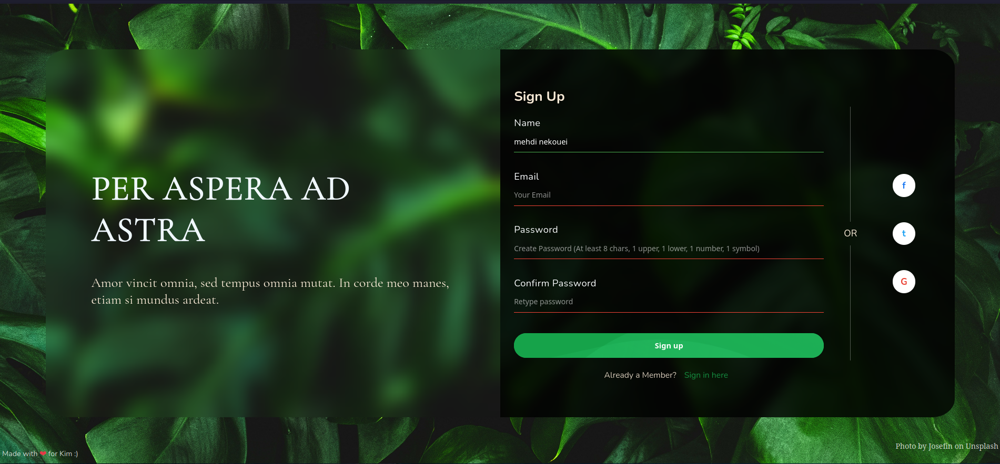

# Sign Up Form

Polished two-panel sign-up page with live validation, animated CTA, and a playful side-swap transition after successful submission.

Originally a Sign Up Form assignment from The Odin Project; the visual design here was reimagined with inspiration from Pinterest to make the layout and form experience feel more polished.

## Features
- Inline validation (name, email, strong password, confirm match) with instant error messaging.
- Animated “Sign up” button with ambient wave effect that runs by default.
- Success action triggers a left/right panel swap animation before submitting.
- Glassmorphism-inspired styling with paired panels, social icons, and accessible focus states.

## Usage
1) Open `index.html` in your browser (no build step needed).  
2) Fill the form with valid values and click “Sign up” to see the swap animation.  
3) Adjust styles in `style.css` and validation rules in `validation.js` as desired.

## Structure
- `index.html` — markup and form fields.
- `style.css` — layout, button animation, swapped-panel styling.
- `validation.js` — input rules and submit handling.
- `SC.png` — current UI snapshot.

## License
Apache 2.0 — see `LICENSE`.
